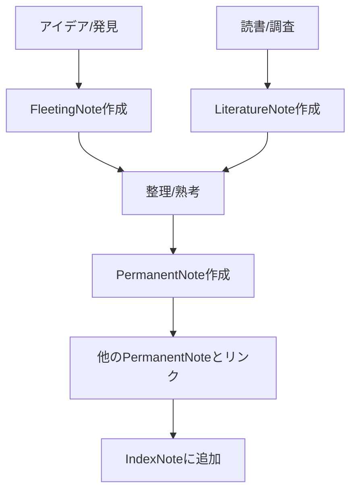
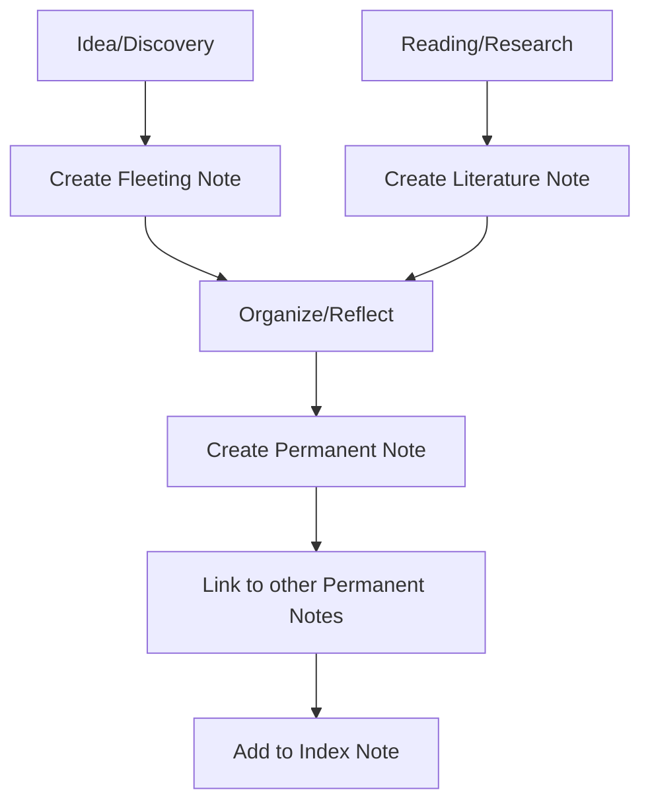

# 📓 Zettelkasten運用ガイド

## 📝 Zettelkastenとは
Zettelkastenは、ドイツの社会学者ニクラス・ルーマンが開発した知識管理システムです。このシステムは、それぞれが独立した「Zettel（メモ）」を作成し、それらの間に明示的なリンクを張ることで、アイデアのネットワークを構築します。

## 📚 ノートの種類と使い方

### 1. FleetingNote（一時ノート）
- **目的**: 一時的な思考やアイデアを即座に捕捉する
- **特徴**: 簡潔、未整理、自分の言葉で記述
- **次のステップ**: 後でLiteratureNoteやPermanentNoteに整理する
- **タイミング**: アイデアが浮かんだらすぐに作成

### 2. LiteratureNote（文献ノート）
- **目的**: 外部ソース（書籍、記事、Web等）からの情報を整理する
- **特徴**: 出典情報を含む、要約と重要ポイントを記録
- **次のステップ**: PermanentNoteの材料として使用
- **タイミング**: 読書や調査の際に作成

### 3. PermanentNote（恒久ノート）
- **目的**: 最終的な知識としてアーカイブ
- **特徴**: 完全に自分の言葉で記述、他のノートへの明示的なリンクを含む
- **次のステップ**: IndexNoteで関連付け、ネットワークに組み込む
- **タイミング**: FleetingNoteやLiteratureNoteを整理した後に作成

### 4. IndexNote（索引ノート）
- **目的**: 関連するノートをまとめて参照できるようにする
- **特徴**: トピックごとのノートへのリンク集
- **次のステップ**: 継続的に更新、拡張
- **タイミング**: 特定のトピックに関するノートが増えたときに作成

## 🔄 実践的なワークフロー

### 日々の実践手順
1. **キャプチャ**: アイデアや発見をFleetingNoteとして即座に記録
2. **収集**: 読書や調査の内容をLiteratureNoteとして整理
3. **熟考**: FleetingNoteとLiteratureNoteを元に考えを深める
4. **作成**: PermanentNoteとして自分の言葉でまとめる
5. **接続**: 関連する他のPermanentNoteとリンクを張る
6. **整理**: IndexNoteを通じてノートを体系化する

## 💡 効果的な使用のためのヒント
- 各ノートは1つのアイデアに焦点を当てる
- 自分の言葉で書き直す（特にPermanentNote）
- 明示的なリンクを積極的に作成する
- 定期的にノートをレビューし、新しい接続を見つける
- IDやタグを活用して検索性を高める

===

# 📓 Zettelkasten Operation Guide

## 📝 What is Zettelkasten?
Zettelkasten is a knowledge management system developed by German sociologist Niklas Luhmann. This system builds a network of ideas by creating independent "Zettel (notes)" and establishing explicit links between them.

## 📚 Types of Notes and How to Use Them

### 1. Fleeting Note
- **Purpose**: Capture temporary thoughts and ideas immediately
- **Characteristics**: Concise, unorganized, written in your own words
- **Next Step**: Later organized into Literature Notes or Permanent Notes
- **Timing**: Create as soon as an idea comes to mind

### 2. Literature Note
- **Purpose**: Organize information from external sources (books, articles, web)
- **Characteristics**: Includes source information, summaries, and key points
- **Next Step**: Used as material for Permanent Notes
- **Timing**: Created during reading or research

### 3. Permanent Note
- **Purpose**: Archive as final knowledge
- **Characteristics**: Written completely in your own words, includes explicit links to other notes
- **Next Step**: Connect to the network through Index Notes
- **Timing**: Created after organizing Fleeting Notes and Literature Notes

### 4. Index Note
- **Purpose**: Enable reference to related notes collectively
- **Characteristics**: Collection of links to notes by topic
- **Next Step**: Continuous updating and expansion
- **Timing**: Created when notes on a specific topic increase

## 🔄 Practical Workflow

### Daily Practice Procedure
1. **Capture**: Immediately record ideas and discoveries as Fleeting Notes
2. **Collect**: Organize reading and research content as Literature Notes
3. **Reflect**: Deepen thoughts based on Fleeting Notes and Literature Notes
4. **Create**: Summarize in your own words as Permanent Notes
5. **Connect**: Create links to other related Permanent Notes
6. **Organize**: Systematize notes through Index Notes

## 💡 Tips for Effective Use
- Focus each note on a single idea
- Rewrite in your own words (especially Permanent Notes)
- Actively create explicit links
- Regularly review notes to find new connections
- Utilize IDs and tags to improve searchability